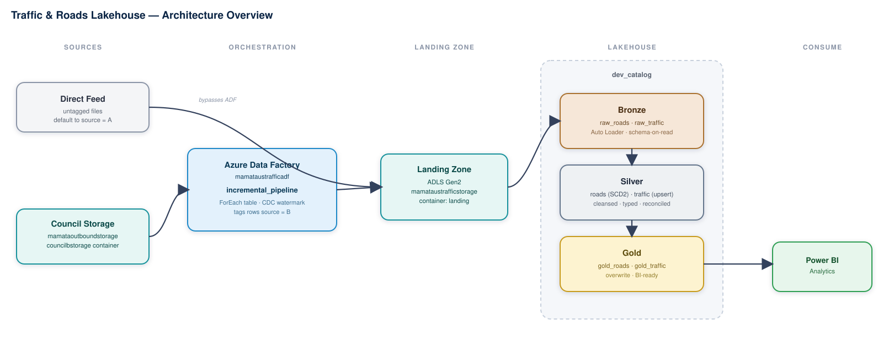
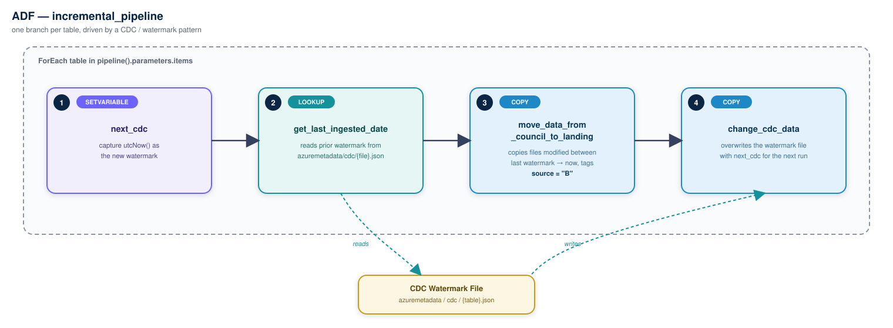
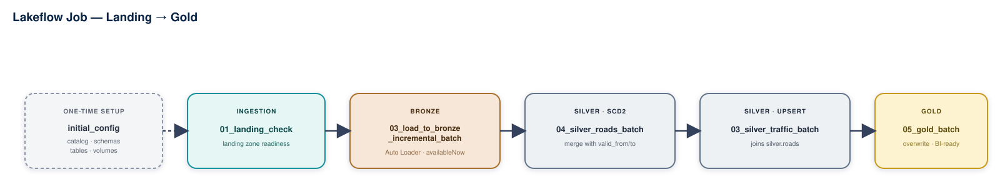

# Traffic & Roads Lakehouse


An end-to-end **medallion lakehouse** on Azure that ingests UK road and traffic count data through **Azure Data Factory**, lands it in **ADLS Gen2**, and processes it through **Bronze → Silver → Gold** using **Databricks Auto Loader, Delta Lake, and Unity Catalog**.

Built as a hands-on project to work through real-world Databricks Data Engineer patterns end to end — incremental/CDC ingestion, schema evolution, SCD2, and job orchestration.



---

## 1. Architecture at a Glance

Two paths feed the same landing zone: an existing/direct feed (untagged, so it defaults to **source = A** downstream) and an **ADF incremental pipeline** that pulls from a separate storage account on a CDC watermark and explicitly tags every row **source = B**. From landing onward, everything runs through one Lakeflow job: Bronze → Silver → Gold.

| Layer | What lives there |
|---|---|
| **Sources** | Direct feed (source A) + council storage account `mamataoutboundstorage` (source B) |
| **Orchestration** | Azure Data Factory `mamataustrafficadf` — `incremental_pipeline` |
| **Landing** | ADLS Gen2, storage account `mamataustrafficstorage`, container `landing` |
| **Lakehouse** | Databricks Unity Catalog, catalog `dev_catalog` — bronze / silver / gold schemas |
| **Consumption** | Power BI / analytics tools reading the gold tables |

---

## 2. Ingestion — ADF `incremental_pipeline`



The pipeline runs a `ForEach` over a parameterized `items` array — one branch per source table — so a single pipeline definition drives any number of tables. Each branch follows a **watermark / CDC pattern**, reading and writing its checkpoint from a small JSON file per table:

1. **`next_cdc`** *(SetVariable)* — captures `utcNow()` as the new watermark.
2. **`get_last_ingested_date`** *(Lookup)* — reads the prior watermark from `azuremetadata/cdc/{cdc_file_name}.json`.
3. **`move_data_from_council_to_landing`** *(Copy)* — copies files modified between the last watermark and now from `council` into `landing`, tagging every row with the static column `source = "B"`.
4. **`change_cdc_data`** *(Copy)* — overwrites the watermark file with `next_cdc`, ready for the next run.

### Linked services & datasets

The source and the landing zone sit in **two different storage accounts**, wired up through two linked services:

| Linked Service | Storage Account | Used by |
|---|---|---|
| `AzureDataLakeStorage1` | `mamataustrafficstorage` | `landing`, `azuremetadata` |
| `AzureDataLakeStorage2` | `mamataoutboundstorage` | `council` |

| Dataset | Type | Container | Role |
|---|---|---|---|
| `council` | DelimitedText, parameterized `folder` (default `raw_road`) + `file` | `councilbstorage` | Copy source |
| `landing` | DelimitedText, parameterized `folder` | `landing` | Copy sink |
| `azuremetadata` | Json, parameterized `file`, fixed `folderPath: cdc` | `azuremetadata` | Watermark store |

The factory itself (`mamataustrafficadf`, region `eastus`) runs on a **system-assigned managed identity**, so it authenticates to Azure resources without a stored secret in the pipeline logic.

---

## 3. Landing → Bronze

Bronze is loaded by `03_load_to_bronze_incremental_batch.ipynb` using **Databricks Auto Loader** (`cloudFiles`), run as an incremental *batch* via `trigger(availableNow=True)` rather than always-on streaming — it processes whatever new files have landed and stops, keeping compute cost-bounded.

- `cloudFiles.schemaLocation` + `cloudFiles.schemaHints` (built from explicit `StructType`s for roads and traffic) pin the expected schema.
- `cloudFiles.schemaEvolutionMode = "rescue"` — unexpected columns land in `_rescued_data` instead of failing the load.
- `source` defaults to `"A"` (`ifnull(col("source"), lit("A"))`) for any row not tagged by the ADF pipeline — the other half of the source-A/source-B split.
- Bronze tables (`raw_roads`, `raw_traffic`) store everything as `STRING` — schema-on-read; typing and cleansing happen in Silver.
- A `COPY INTO` SQL variant is sketched alongside as a non-streaming alternative for the traffic table.

---

## 4. Bronze → Silver

Two notebooks, with a real dependency: **roads runs before traffic**, since the traffic transform joins against `silver.roads` to backfill `link_length_km`.

### 4a. Roads — `04_silver_roads_batch.ipynb` (SCD2)

- Casts types (`try_cast`), nulls out any `road_category` outside a controlled vocabulary, and maps category codes to descriptive names via a broadcast lookup (`TA`, `TM`, `PA`, `PM`, `M`).
- Derives `expected_road_type` from the category name and flags `road_type_consistent` — comparing the sourced `road_type` against what the category implies.
- Merges into `silver.roads` keyed on `(count_point_id, source)` in two steps: close the matching row (`valid_to = current_timestamp()`), then insert not-matched rows with `valid_from = current_timestamp()`.

**Known limitation:** the second `MERGE`'s `WHEN NOT MATCHED` uses the same `(count_point_id, source)` key as the first, so re-running against a key that already exists closes the current row but doesn't open a fresh version for it — the insert only fires for keys that don't exist in `target` at all. Fixing this for continuous history means re-checking `valid_to IS NULL` in the match condition, or inserting on `WHEN MATCHED AND <attributes changed>` too.

### 4b. Traffic — `03_silver_traffic_batch.ipynb` (straight upsert)

- Casts every count column (`pedal_cycles`, `cars_and_taxis`, `all_HGVs`, etc.) to `int`.
- Joins to `silver.roads` for `link_length_km`, recomputes total motor vehicles from the individual vehicle-class columns, and flags `vehicle_count_consistent` where the recomputed total disagrees with the sourced `all_motor_vehicles`.
- Derives `total_traffic_volume`, `vehicle_intensity` (vehicles per km, null-safe against zero/blank length), and `is_estimated`.
- Merges into `silver.traffic` keyed on `count_point_id` only (`UPDATE SET * / INSERT *`) — a simple upsert, no history retained.

---

## 5. Silver → Gold

`05_gold_batch.ipynb` overwrites `gold_traffic` and `gold_roads` from their Silver sources on every run, adding a `Load_Time` stamp. Presentation-ready tables for BI consumption — no incremental logic at this layer, it re-derives from Silver each time.

---

## 6. Orchestration — Lakeflow Job



`04_silver_roads_batch` runs before `03_silver_traffic_batch` in the job graph even though its filename sorts after it alphabetically — the real dependency comes from the `silver.roads` read inside the traffic notebook, not from the naming.

---

## 7. Unity Catalog Layout

Provisioned by `initial_config.ipynb`.

| Schema | Purpose |
|---|---|
| `bronze` | Default managed location |
| `silver` | Managed location on the `silver` container |
| `gold` | Managed location on the `gold` container |
| `landing` | Holds the `landing_vol` external volume |
| `checkpoints` | Holds the `checkpoint_vol` external volume |
| `default` | Houses the shared `pipeline_errors` log table |

**External locations** — all via storage credential `ustrafficcredential` on `mamataustrafficstorage`:

| External Location | Container |
|---|---|
| `landing` | `landing` |
| `bronze` | `bronze` |
| `silver` | `silver` |
| `gold` | `gold` |
| `checkpoints` | `checkpoints` |

`council`, `azuremetadata`, and `councilbstorage` are raw ADLS containers used only by the ADF pipeline for source data and watermark tracking — they sit outside the Unity Catalog object model above.

**Key tables**

| Layer | Table | Notes |
|---|---|---|
| bronze | `raw_roads`, `raw_traffic` | All-`STRING` columns + `Extract_Time` |
| bronze | `vehicle_type_lookup` | Small reference/lookup table |
| silver | `roads` | SCD2 shape (`valid_from`/`valid_to`), `CLUSTER BY AUTO` |
| silver | `traffic` | Upsert fact table, `CLUSTER BY AUTO` |
| gold | `gold_roads`, `gold_traffic` | Overwritten each run, `Load_Time` added |
| default | `pipeline_errors` | Shared error log — see §8 |

---

## 8. Error Handling & Data Quality

Every notebook defines the same `log_pipeline_error(step_name, error)` helper, appending a row (`notebook`, `step`, `error_message`, `error_time`) to `dev_catalog.default.pipeline_errors` inside a `try/except … raise` around each risky step — one consistent observability pattern reused across the whole pipeline.

Data-quality signals produced along the way:
- `_rescued_data` (Bronze) — captures anything Auto Loader didn't expect, instead of failing the load.
- `road_type_consistent` (Silver Roads) — sourced `road_type` vs. type implied by `road_category`.
- `vehicle_count_consistent` (Silver Traffic) — sourced `all_motor_vehicles` vs. recomputed sum of vehicle-class columns.

---

## 9. Repository Structure

```
.
├── factory/mamataustrafficadf.json        # ADF factory definition (system-assigned identity, eastus)
├── pipeline/
│   ├── incremental_pipeline.json          # see §2
│   └── pipeline1.json                     # secondary ADF pipeline
├── dataset/
│   ├── council.json                       # source dataset — councilbstorage
│   ├── landing.json                       # sink dataset — landing container
│   └── azuremetadata.json                 # watermark file dataset — cdc folder
├── linkedService/
│   ├── AzureDataLakeStorage1.json         # mamataustrafficstorage
│   └── AzureDataLakeStorage2.json         # mamataoutboundstorage
├── notebooks/
│   ├── preingestion/
│   │   └── initial_config.ipynb           # §7 — catalog / schema / table provisioning
│   ├── ingestion/
│   │   ├── 01_landing_check.ipynb         # landing zone pre-load check
│   │   └── 03_load_to_bronze_incremental_batch.ipynb  # §3
│   └── transformation/
│       ├── 04_silver_roads_batch.ipynb    # §4a — SCD2
│       ├── 03_silver_traffic_batch.ipynb  # §4b — upsert
│       └── 05_gold_batch.ipynb            # §5
├── utils/
│   ├── __init__.py
│   └── schema.py                          # shared PySpark schema definitions
├── docs/                                  # architecture diagrams used in this README
├── publish_config.json                    # ADF CI/CD publish config
└── LICENSE
```

---

## 10. Tech Stack

- **Orchestration / ingestion:** Azure Data Factory (ForEach, Lookup, Copy, SetVariable), watermark/CDC pattern
- **Storage:** Azure Data Lake Storage Gen2, Unity Catalog external locations & volumes
- **Compute / processing:** Databricks (PySpark, Spark SQL), Auto Loader (`cloudFiles`), Structured Streaming with `availableNow` batch trigger
- **Storage format:** Delta Lake (`CLUSTER BY AUTO`, `MERGE INTO`)
- **Governance:** Unity Catalog (catalog/schema/external location/volume model, storage credentials)

---

## 11. Run Order

1. **Provision** — run `initial_config.ipynb` once to create the catalog, schemas, external locations/volumes, and tables.
2. **Ingest** — trigger the ADF `incremental_pipeline` to land source-B files (the direct/source-A feed lands independently).
3. **Process** — the Lakeflow job runs `01_landing_check → 03_load_to_bronze_incremental_batch → 04_silver_roads_batch → 03_silver_traffic_batch → 05_gold_batch`, on a schedule or event trigger.
4. **Consume** — point Power BI (or any analytics tool) at `dev_catalog.gold.gold_roads` and `dev_catalog.gold.gold_traffic`.

---

## License

See [`LICENSE`](./LICENSE).
